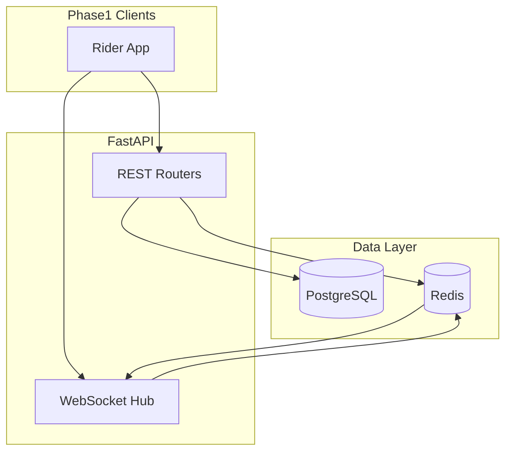
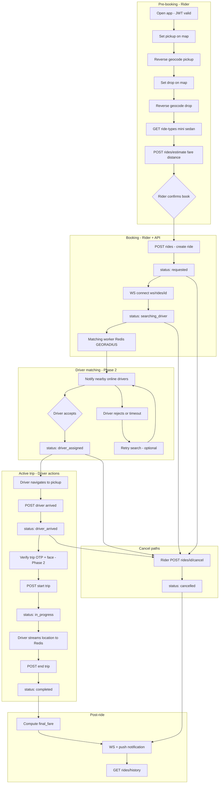
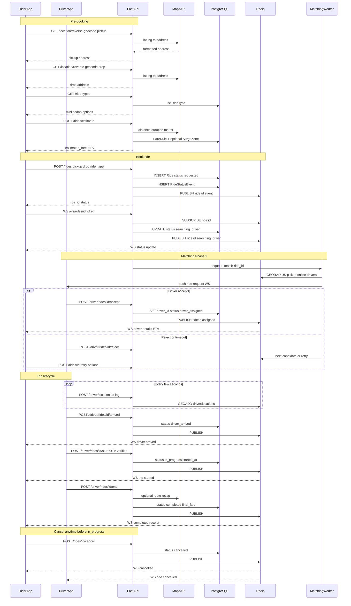
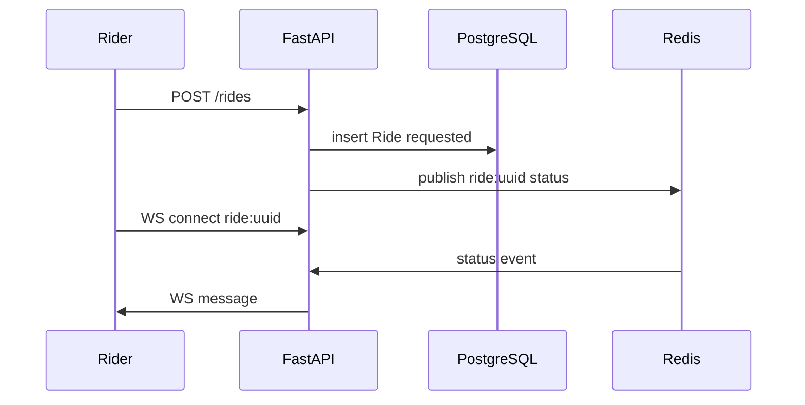

# Go4Ride Python Backend Plan (Rider First)

## Context

- Workspace [`/Users/krishna/go4ride/backend`](/Users/krishna/go4ride/backend) is **empty** — full greenfield.
- **Phase 1 scope:** Rider mobile app APIs + shared foundation that driver/admin will reuse later.
- **Real-time:** WebSockets from FastAPI (your choice); Redis pub/sub to fan out events across workers.

## Recommended stack

| Layer | Choice | Why |
|-------|--------|-----|
| API | **FastAPI** + Uvicorn | Async, OpenAPI for mobile teams, native WebSocket support |
| DB | **PostgreSQL 16** + SQLAlchemy 2.0 (async) + **Alembic** | Relational ride/booking data, migrations |
| Cache / geo / pub-sub | **Redis 7** | `GEOADD`/`GEORADIUS` for nearby drivers (Phase 2), pub/sub for WS broadcast |
| Auth | **JWT** (access + refresh) + **OTP** (SMS provider) | Same token shape for rider/driver/admin later (`role` claim) |
| Files | **S3-compatible** (AWS S3 or MinIO in dev) | Driver docs / face upload in Phase 2 |
| Background jobs | **ARQ** or **Celery** (Phase 2+) | Driver matching retries, notification fan-out |
| Maps | **Google Maps Platform** or **Mapbox** | Distance/duration, reverse geocoding |



---

## Project layout (create in Phase 0)

```
backend/
├── app/
│   ├── main.py                 # FastAPI app, lifespan, CORS
│   ├── core/
│   │   ├── config.py           # pydantic-settings (env)
│   │   ├── security.py         # JWT, password hashing if needed
│   │   └── deps.py             # DB session, current_user
│   ├── db/
│   │   ├── base.py
│   │   └── session.py
│   ├── models/                 # SQLAlchemy ORM
│   ├── schemas/                # Pydantic request/response
│   ├── api/
│   │   └── v1/
│   │       ├── router.py
│   │       ├── auth.py
│   │       ├── rides.py
│   │       ├── location.py
│   │       └── ws.py
│   ├── services/               # business logic (no HTTP here)
│   │   ├── auth_service.py
│   │   ├── ride_service.py
│   │   ├── fare_service.py
│   │   └── geo_service.py
│   └── workers/                # Phase 2: matching, notifications
├── alembic/
├── tests/
├── docker-compose.yml          # postgres + redis + minio
├── pyproject.toml
├── .env.example
└── README.md
```

---

## Core data model (design now, implement incrementally)

Entities needed for **rider Phase 1** (driver/admin fields nullable or stubbed):

- **User** — `id`, `phone` (unique), `email`, `name`, `role` (`rider` \| `driver` \| `admin`), `is_blocked`, timestamps
- **OTPVerification** — `phone`, `code_hash`, `expires_at`, `purpose` (`login` \| `register`)
- **RefreshToken** — optional blacklist table for logout
- **RideType** — `mini`, `sedan`, base fare rules (seed data)
- **FareRule** — per km/min, base fare, minimum fare (admin-managed later)
- **Ride** — `id`, `rider_id`, `driver_id` (nullable), `status`, pickup/drop lat-lng + address text, `estimated_fare`, `final_fare`, `ride_type_id`, timestamps per status
- **RideStatusEvent** — audit trail for lifecycle + notifications
- **Payment** — stub for Phase 3 (not in rider MVP)

**Ride status enum** (single source of truth for REST + WS + notifications):

`requested` → `searching_driver` → `driver_assigned` → `driver_arrived` → `in_progress` → `completed` | `cancelled`

Phase 1 rider APIs can stop at `requested` / `searching_driver` / `cancelled` until driver matching exists; WS still emits transitions.

---

## End-to-end ride booking flow

Full journey across **rider app**, **driver app**, **FastAPI**, **PostgreSQL**, **Redis**, and **Maps API**. Phase 1 implements the left/pre-booking column and create/cancel; matching through completion unlock in Phase 2.

### High-level flow (states + actors)



### Detailed sequence (APIs + real-time)



### Status timeline (what the rider sees)

| Step | Ride status | Trigger | Rider UI | Real-time |
|------|-------------|---------|----------|-----------|
| 1 | — | Pickup/drop + estimate | Fare preview | REST only |
| 2 | `requested` | `POST /rides` | “Confirming…” | WS optional |
| 3 | `searching_driver` | Matching worker starts | “Finding driver…” | WS + push |
| 4 | `driver_assigned` | Driver accepts | Driver name, vehicle, ETA | WS + push |
| 5 | `driver_arrived` | Driver at pickup | “Driver has arrived” | WS + push |
| 6 | `in_progress` | Start trip (+ OTP/face) | Live map / tracking | WS + location |
| 7 | `completed` | End trip | Receipt, rate driver | WS + push |
| — | `cancelled` | Rider or system cancel | Cancelled screen | WS + push |

### Backend responsibilities per step

**In plain English** — what the server is responsible for at each stage:

1. **Geocode + estimate** — Turn map coordinates into readable addresses for pickup and drop. Call the maps provider for route distance and travel time. Look up your fare rules (and surge, when enabled) and return a price quote the rider can accept before booking. Do not create a ride record yet.

2. **Create ride** — When the rider confirms, save a new ride with pickup/drop, ride type, and quoted fare. Record the first status (`requested`, then `searching_driver`). Enforce auth, idempotency, and validation (e.g. rider not blocked, coordinates in service area).

3. **Real-time updates** — Keep a live channel open for that ride so the app does not have to poll. Whenever status changes, broadcast the update to connected clients (rider and, later, driver) via WebSocket, using Redis so all API instances stay in sync.

4. **Match driver** — Find online drivers near the pickup (Redis geo index). Send the request to one or more drivers. When a driver accepts, attach them to the ride and move status to `driver_assigned`. Handle rejections, timeouts, and optional retry without leaving the ride in a stuck state.

5. **Trip transitions** — Apply driver actions in order: arrived at pickup, start trip (after OTP/face checks when required), end trip. Update status and timestamps on each step. Reject invalid transitions (e.g. start before arrived). Optionally recalculate final fare at end using actual distance/time.

6. **Notifications** — On every status change, notify interested parties: WebSocket immediately for foreground apps; mobile push (FCM/APNs) when the app is backgrounded (Phase 1.5). Use the same event source so REST, WS, and push never disagree about current ride state.

| Step | Service | Stores |
|------|---------|--------|
| Geocode + estimate | `geo_service`, `fare_service` | Read `FareRule`; call Maps |
| Create ride | `ride_service` | `rides`, `ride_status_events` |
| Real-time updates | `ws` hub + Redis pub/sub | Channel `ride:{id}` |
| Match driver | `matching_service` worker | Redis geo index; update `rides.driver_id` |
| Trip transitions | `ride_service` driver routes | Status + timestamps on `rides` |
| Notifications | event on every status change | Same Redis publish → WS; FCM in Phase 1.5 |

---

## Phase 0 — Foundation (1–2 days)

1. **Scaffold** FastAPI project, `docker-compose` (Postgres, Redis, MinIO optional).
2. **Settings** via `pydantic-settings`: `DATABASE_URL`, `REDIS_URL`, `JWT_SECRET`, `OTP_PROVIDER_*`, `MAPS_API_KEY`.
3. **Alembic** initial migration: `users`, `otp_verifications`, `ride_types`, `fare_rules`, `rides`, `ride_status_events`.
4. **Auth primitives**
   - Issue JWT: `sub`, `role`, `exp`; refresh token in HttpOnly cookie or body (mobile-friendly: return refresh in JSON).
   - Dependency `get_current_rider` — rejects `role != rider`.
5. **Global** exception handlers, request ID middleware, structured logging.
6. **Health** `GET /health`, OpenAPI at `/docs`.

No rider-facing business APIs yet — only plumbing.

---

## Phase 1 — Rider app APIs (your estimated list, mapped)

### 1. Authentication (rider subset of your 8 endpoints)

| # | Endpoint | Method | Notes |
|---|----------|--------|-------|
| 1 | `/api/v1/auth/register` | POST | Phone + name; sends OTP; creates user `role=rider` after verify |
| 2 | `/api/v1/auth/login` | POST | Phone → OTP |
| 6 | `/api/v1/auth/verify-otp` | POST | Returns access + refresh JWT |
| 5 | `/api/v1/auth/logout` | POST | Invalidate refresh token |

**Defer to Phase 2 (driver):** register driver, login driver, upload document, face upload — same `auth` router, different `role` and KYC tables (`DriverProfile`, `DriverDocument`).

**OTP flow:** rate-limit by phone/IP in Redis; store hashed OTP; integrate **Twilio** or **MSG91** (config switch).

### 2. Location and map (rider-facing)

| # | Endpoint | Method | Notes |
|---|----------|--------|-------|
| 4 | `/api/v1/location/reverse-geocode` | GET | `lat`, `lng` → address via Maps API |
| 3 | `/api/v1/rides/estimate` | POST | Pickup/drop + `ride_type` → distance, duration, fare (uses `FareRule` + Maps) |

**Phase 2 (needs online drivers):** `GET /api/v1/drivers/nearby` — Redis `GEORADIUS` on `driver:locations`.

### 3. Ride booking

| # | Endpoint | Method | Notes |
|---|----------|--------|-------|
| 4 | `/api/v1/ride-types` | GET | List mini/sedan + icons/descriptions |
| 3 | `/api/v1/rides/estimate` | POST | (above) |
| 1 | `/api/v1/rides` | POST | Create ride → `status=requested`, then enqueue `searching_driver` (stub worker returns 503 or mock assign in dev) |
| 2 | `/api/v1/rides/{id}/cancel` | POST | Rider cancel rules (only before `in_progress`) |

### 4. Ride lifecycle (rider view)

| # | Endpoint | Method | Notes |
|---|----------|--------|-------|
| 5 | `/api/v1/rides/{id}/status` | GET | Current status + driver summary if assigned |
| 6 | `/api/v1/rides/{id}` | GET | Full ride details |
| 7 | `/api/v1/rides/history` | GET | Paginated list for current rider |

**Phase 2+ (driver actions):** arrived, start, end trip — implemented on driver router but update same `Ride` row and emit WS events.

**Phase 2:** trip OTP + face verification at start — `Ride.start_otp`, `DriverProfile.face_embedding_url` or manual admin flag.

### 5. Notifications + WebSocket

| # | Mechanism | Notes |
|---|-----------|-------|
| 1 | `WS /api/v1/ws/rides/{ride_id}?token=...` | Authenticated rider subscribes; server pushes `RideStatusEvent` payloads |
| — | Redis channel `ride:{id}` | On status change: `publish` → all Uvicorn workers → WS manager sends to connected clients |

**Push (FCM/APNs):** optional Phase 1.5 — same event triggers mobile push when app backgrounded; store `UserDevice.fcm_token` on login.



### 6. Rider profile / stats (your bottom list)

| # | Endpoint | Method | Notes |
|---|----------|--------|-------|
| 3 | `/api/v1/profile` | GET/PATCH | Name, phone, email, avatar |
| 1 | `/api/v1/stats` | GET | Total rides, spend, rating avg (when ratings exist) |
| 2 | `/api/v1/rides/history` | GET | Same as lifecycle #7 |

---

## Phase 2 — Driver app (after rider MVP stable)

- Driver auth + KYC: register, login, document upload (S3 presigned URLs), face photo
- `PATCH /api/v1/driver/status` — online/offline (sets Redis geo + availability flag)
- `POST /api/v1/driver/location` — high-frequency updates → Redis `GEOADD`
- Accept/reject ride, arrived, start, end trip
- **Matching service:** on `ride.created`, find nearby online drivers (Redis), notify via WS + push; accept assigns `driver_id`; retry endpoint
- Rider endpoints: nearby drivers (optional map preview before book)

---

## Phase 3 — Admin panel APIs

Separate router prefix `/api/v1/admin` + `role=admin` guard:

| Module | Key endpoints |
|--------|----------------|
| User management | list/search users, block/unblock, user ride history |
| Driver management | pending KYC queue, approve/reject, suspend, view documents |
| Quick actions | force driver offline (delete Redis geo + set status) |
| Live map | `GET /admin/drivers/live` — Redis geo + status aggregate |
| Fare management | CRUD `FareRule`, ride types |
| Surge | zones + multiplier schedules (new `SurgeZone` model) |
| Dashboard | rides/day, revenue, active drivers (SQL aggregates) |
| Support | tickets linked to `ride_id` / `user_id` |

Admin UI is a separate frontend; backend only exposes JSON aligned to your admin screens.

---

## API conventions (apply from day one)

- Prefix: `/api/v1`
- JSON errors: `{ "detail": "...", "code": "RIDE_NOT_CANCELLABLE" }`
- Pagination: `?page=1&limit=20` on history/list endpoints
- Idempotency: `Idempotency-Key` header on `POST /rides` (store in Redis 24h)
- Version mobile contracts via OpenAPI export in CI

---

## Security checklist

- JWT short-lived access (15m) + refresh (7d)
- Rate limits: OTP, login, create ride
- Validate lat/lng bounds; sanitize addresses from geocoder
- Presigned S3 uploads — never stream DL/RC through API body
- CORS: rider app bundle IDs / dev origins only
- Admin routes behind separate secret or IP allowlist in production

---

## Testing strategy (minimal but useful)

- **pytest** + **httpx** `AsyncClient` against test DB (docker)
- Unit tests: `fare_service` (distance → price), status transitions
- Integration: register → verify OTP → create ride → WS receives status
- Redis/geo tests in Phase 2

---

## Suggested implementation order (rider app)

1. Phase 0 scaffold + models + migrations  
2. OTP auth + profile  
3. Reverse geocode + fare estimate + ride types seed  
4. Create / cancel ride + status/detail/history REST  
5. WebSocket + Redis pub/sub for ride channel  
6. Stats endpoint  
7. Phase 2 driver location + matching (unblocks full lifecycle)  
8. Phase 3 admin  

---

## What you will **not** build in Phase 1

- Driver register/login, document/face upload  
- Auto driver assign (stub `searching_driver` only)  
- Accept/reject, retry search, driver arrived/start/end  
- Surge, admin CRUD, live admin map  
- Payment capture (unless you add a explicit requirement later)

---

## Environment variables (`.env.example`)

```
DATABASE_URL=postgresql+asyncpg://...
REDIS_URL=redis://localhost:6379/0
JWT_SECRET=...
JWT_ACCESS_EXPIRE_MINUTES=15
OTP_PROVIDER=msg91|twilio
MAPS_PROVIDER=google|mapbox
MAPS_API_KEY=...
AWS_S3_BUCKET=...
CORS_ORIGINS=["http://localhost:3000"]
```

---

## Next step after you approve this plan

Implement **Phase 0 + Phase 1** in the empty [`backend`](/Users/krishna/go4ride/backend) folder: `docker-compose up`, first Alembic migration, rider auth and ride APIs, WebSocket hub — with a short README and Postman/OpenAPI collection for the mobile team.
