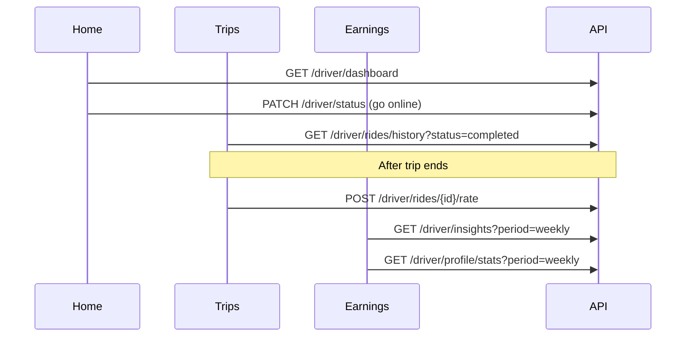

# Go4Ride Driver UI — API Integration Guide

Use this document when wiring the driver app to the Go4Ride backend. It maps the **Trips**, **Home**, and **Earnings** screens to API endpoints.

---

## 1. Environment & Base URLs

| Environment | Base URL |
|-------------|----------|
| **Production** | `https://go4ride-api.onrender.com` |
| **Local dev** | `http://localhost:8000` |

- Driver routes: **`/api/v1/driver/...`**
- Auth: driver JWT via `POST /api/v1/driver/auth/verify-otp`
- Header: `Authorization: Bearer <access_token>`

---

## 2. Global Conventions

All `/api/v1` JSON endpoints return:

```json
{
  "success": true,
  "message": "Human-readable summary",
  "data": { }
}
```

---

## 3. Trips Screen

### 3.1 Trip list with filters

**`GET /api/v1/driver/rides/history`**

| Query | Default | Values |
|-------|---------|--------|
| `page` | `1` | ≥ 1 |
| `limit` | `20` | 1–100 |
| `status` | `terminal` | `terminal`, `all`, `completed`, `cancelled` |

**UI mapping**

| UI element | Response field |
|------------|----------------|
| Tab: All | `?status=terminal` (completed + cancelled) |
| Tab: Completed | `?status=completed` |
| Tab: Cancelled | `?status=cancelled` |
| Header "N trips" | `data.total` |
| Status badge | `rides[].status` |
| Date/time | `rides[].completed_at` or `rides[].cancelled_at` |
| Earnings | `rides[].earnings` (same as `final_fare` when completed) |
| Star rating | `rides[].rider_rating` (1–5, null if not rated) |
| Pickup / drop | `rides[].pickup_address`, `rides[].drop_address` |
| Duration / distance | `rides[].duration_min`, `rides[].distance_km` |

**Example**

```http
GET /api/v1/driver/rides/history?status=completed&page=1&limit=20
Authorization: Bearer <driver_token>
```

### 3.2 Rate rider (post-trip)

**`POST /api/v1/driver/rides/{ride_id}/rate`**

```json
{ "score": 4, "comment": "optional" }
```

---

## 4. Home Screen (dashboard card)

### 4.1 Single dashboard call

**`GET /api/v1/driver/dashboard`**

| UI element | Response field |
|------------|----------------|
| Today earning | `today_earnings` |
| Trips count | `today_trips` |
| Online hours | `online_hours_today` |
| Rating | `rating` |
| Online/offline state | `driver_status` |
| Active trip | `current_ride` (null if none) |
| Currency | `currency` |

**Example response shape**

```json
{
  "success": true,
  "data": {
    "today_earnings": "284.00",
    "today_trips": 5,
    "online_hours_today": 3.5,
    "rating": "4.90",
    "driver_status": "online",
    "current_ride": null,
    "currency": "INR"
  }
}
```

### 4.2 Go online / offline (session tracking)

**`PATCH /api/v1/driver/status`**

```json
{
  "status": "online",
  "latitude": "12.9716",
  "longitude": "77.5946"
}
```

Going **online** opens an online session; **offline** or **logout** closes it. Online hours on dashboard/insights are computed from these sessions.

**`POST /api/v1/driver/auth/logout`** — also sets driver offline and closes the session.

### 4.3 Location label ("San Diego")

Reverse-geocode on the client using `current_lat` / `current_lng` from profile or status request. No dedicated city field on dashboard.

---

## 5. Earnings Screen

### 5.1 Period insights (Day / Week toggle)

**`GET /api/v1/driver/insights?period=daily|weekly|monthly`**

| UI element | Response field |
|------------|----------------|
| Day / Week toggle | `period=daily` or `period=weekly` |
| Total earnings | `earnings` |
| % vs last period | `comparison_pct` |
| Bar chart | `trend[]` — each point has `label`, `earnings`, `ride_count` |
| Trips | `rides_count` |
| Online | `online_hours` |
| Per hour | `earnings_per_hour` |
| Active hours | `active_hours` |
| Currency | `currency` |

**Example trend point**

```json
{ "label": "Sat", "date": "2026-05-24", "ride_count": 8, "earnings": "284.00" }
```

### 5.2 Performance metrics grid

**`GET /api/v1/driver/profile/stats?period=weekly`**

| UI element | Response field |
|------------|----------------|
| Acceptance % | `acceptance_rate` (0–1, display as %) |
| Completion % | `completion_rate` |
| Rating | `rating` |
| Active hrs | `active_hours` |
| Online hrs | `online_hours` |

`period`: `all`, `daily`, `weekly` (default), `monthly`

### 5.3 Earnings summary (optional separate call)

**`GET /api/v1/driver/profile/earnings`**

Returns `today`, `this_week`, `this_month`, `total`, `currency` — aggregated from completed ride `final_fare` values.

---

## 6. Rider rates driver (rider app)

**`POST /api/v1/rides/{ride_id}/rate`** (rider token)

```json
{ "score": 5, "comment": "Great ride" }
```

Updates `DriverProfile.rating` and populates `rider_rating` on driver trip history.

---

## 7. Recommended client flow



---

## 8. Live navigation (polylines & WebSocket)

During an active trip, the driver map uses the same polyline model as the rider app.

| Polyline | Meaning | When available |
|----------|---------|----------------|
| `route_polyline` | Pickup → drop (full trip route) | After rider books (`searching_driver` onward) |
| `leg_polyline` | Driver → pickup, then driver → drop when `in_progress` | After accept, while driver has GPS and ride is active |

### 8.1 REST (poll fallback)

| Endpoint | Polylines |
|----------|-----------|
| `GET /api/v1/driver/rides/current` | `route_polyline`, `leg_polyline` (refreshes leg) |
| `GET /api/v1/driver/rides/{ride_id}/status` | `route_polyline`, `leg_polyline`, `start_otp` |
| `POST .../arrived`, `POST .../start` | Full `DriverRideResponse` includes both polylines |
| `GET /api/v1/driver/rides/search` | `route_polyline` only (no leg until accepted) |
| `GET /api/v1/driver/rides/history` | `route_polyline` if stored; `leg_polyline` usually null |

Decode polylines with the **Google encoded polyline** format (same as rider app).

### 8.2 WebSocket (preferred)

**`WS /api/v1/ws/rides/{ride_id}?token={driver_access_token}`**

Assigned drivers may connect (same channel as the rider). Events include `route_polyline` and `leg_polyline`:

```json
{
  "type": "status",
  "ride_id": "...",
  "status": "driver_assigned",
  "route_polyline": "encoded_pickup_to_drop",
  "leg_polyline": "encoded_driver_to_pickup"
}
```

```json
{
  "type": "location_update",
  "ride_id": "...",
  "status": "in_progress",
  "route_polyline": "...",
  "leg_polyline": "...",
  "driver": { "lat": "...", "lng": "...", "eta_min": 5 },
  "updated_at": "..."
}
```

Leg updates are published when the driver sends **`PATCH /api/v1/driver/location`** while on a trip.

### 8.3 Recommended client flow

1. After accept → `GET /driver/rides/current` or connect WebSocket.
2. Render `route_polyline` (full trip) + `leg_polyline` (navigation leg).
3. On `location_update` events, update driver marker and `leg_polyline`.
4. When status becomes `in_progress`, leg switches to driver → drop.

---

## 9. Related endpoints

| Purpose | Endpoint |
|---------|----------|
| Active ride | `GET /api/v1/driver/rides/current` |
| Ride status + map | `GET /api/v1/driver/rides/{id}/status` |
| Search rides | `GET /api/v1/driver/rides/search` |
| Accept / reject | `POST /api/v1/driver/rides/{id}/accept` or `/reject` |
| GPS while online | `PATCH /api/v1/driver/location` |
| Profile | `GET /api/v1/driver/profile` |
| Live ride updates | `WS /api/v1/ws/rides/{ride_id}?token=...` (driver or rider JWT) |

---

## 10. Error codes (common)

| Code | When |
|------|------|
| `RIDE_NOT_COMPLETED` | Rating before trip completed |
| `RATING_EXISTS` | Duplicate rating for same ride |
| `INVALID_STATUS_FILTER` | Bad `status` on history |
| `INVALID_PERIOD` | Bad `period` on insights |
| `KYC_NOT_APPROVED` | Going online before KYC approved |
