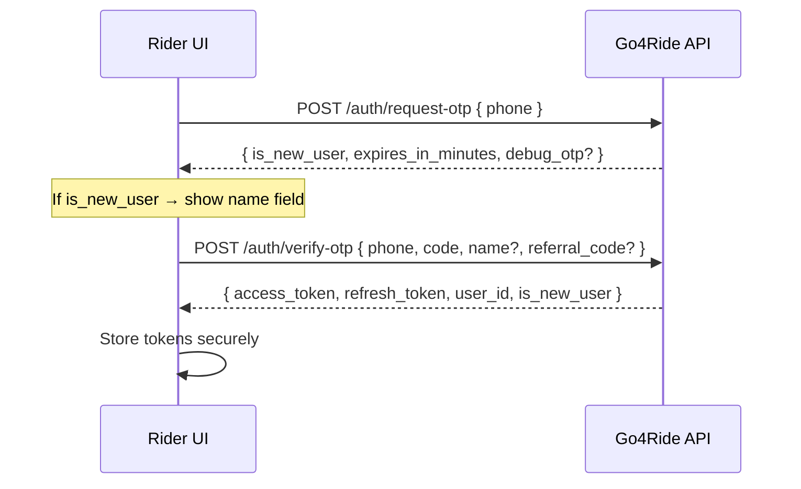
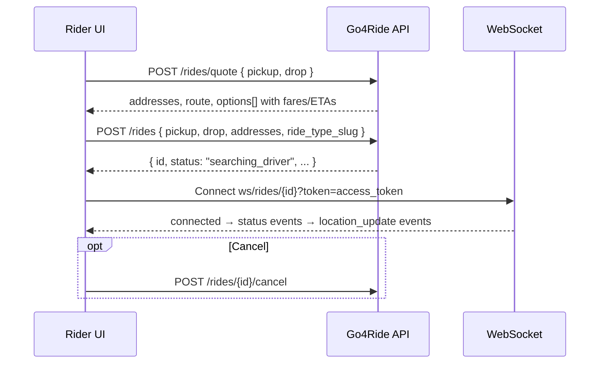

# Go4Ride Rider UI — API Integration Guide

Use this document as context when wiring the rider app to the Go4Ride backend. It covers every rider-facing endpoint, request/response shapes, auth, flows, and client patterns.

---

## 1. Environment & Base URLs

| Environment | Base URL | Docs |
|-------------|----------|------|
| **Production** | `https://go4ride-api.onrender.com` | `/docs` |
| **Local dev** | `http://localhost:8000` | `/docs` |

- All business routes: **`/api/v1/...`**
- Health check (no prefix): **`GET /health`**
- OpenAPI spec in repo: `docs/openapi.json`

---

## 2. Global Conventions

### 2.1 Response envelope

Every `/api/v1` JSON endpoint returns:

```json
{
  "success": true,
  "message": "Human-readable summary",
  "data": { /* payload or null */ }
}
```

On error:

```json
{
  "success": false,
  "message": "Ride cannot be cancelled",
  "data": {
    "code": "RIDE_NOT_CANCELLABLE",
    "errors": null
  }
}
```

Validation errors (`422`) include `data.errors` with field-level details.

**Client pattern:**

```typescript
type ApiResponse<T> = {
  success: boolean;
  message: string;
  data: T | { code: string; errors?: unknown[] } | null;
};

async function apiCall<T>(...): Promise<T> {
  const res = await fetch(...);
  const body: ApiResponse<T> = await res.json();
  if (!body.success) throw new ApiError(body.message, body.data?.code);
  return body.data as T;
}
```

### 2.2 Authentication

| Token | Lifetime | Usage |
|-------|----------|-------|
| `access_token` | 15 min | `Authorization: Bearer <token>` on protected HTTP routes |
| `refresh_token` | 7 days | Body of `/auth/refresh` and `/auth/logout` |

**Protected routes** require `Authorization: Bearer <access_token>` and **rider role** (`403 FORBIDDEN` if not a rider).

**WebSocket** uses access token as query param: `?token=<access_token>` (not header).

### 2.3 Common headers

| Header | When | Purpose |
|--------|------|---------|
| `Content-Type: application/json` | POST/PATCH with body | Required |
| `Authorization: Bearer ...` | Protected routes | Auth |
| `Idempotency-Key: <unique>` | `POST /rides` | Prevents duplicate bookings (24h cache) |
| `X-Request-ID: <uuid>` | Optional | Echoed back in response |

### 2.4 Pagination

Query params: `page` (default `1`), `limit` (default `20`, max `100`).

### 2.5 Data types

- **Phone:** 10–15 chars, E.164 preferred (`+919876543210`)
- **Coordinates:** `lat` (-90 to 90), `lng` (-180 to 180) as decimals/strings
- **Money:** Decimal strings like `"120.00"`, currency `"INR"`
- **IDs:** UUID strings

---

## 3. Screen → API Mapping

| App screen / feature | APIs to call |
|---------------------|--------------|
| **Splash / health** | `GET /health` |
| **Phone login** | `POST /auth/request-otp` |
| **OTP verify** | `POST /auth/verify-otp` |
| **Name onboarding** (new users) | Pass `name` in verify-otp, or `PATCH /profile` later |
| **Referral on signup** | Pass `referral_code` in verify-otp (new users only) |
| **Session restore** | `POST /auth/refresh`, then `GET /auth/me` or `GET /profile` |
| **Home / map pickup** | `GET /location/reverse-geocode?lat=&lng=` |
| **Ride type selection** | `POST /rides/quote` |
| **Confirm booking** | `POST /rides` (+ `Idempotency-Key`) |
| **Active ride tracking** | `WS /ws/rides/{ride_id}?token=...` (primary), fallback `GET /rides/{id}/status` |
| **Cancel ride** | `POST /rides/{ride_id}/cancel` |
| **Bookings / history** | `GET /rides/history?status=terminal&page=1&limit=20` |
| **Ride detail** | `GET /rides/{ride_id}` |
| **Receipt / invoice** | `GET /rides/{ride_id}/invoice` |
| **Repeat ride** | `POST /rides/{ride_id}/repeat` → quote → create |
| **Profile** | `GET /profile`, `PATCH /profile` |
| **Stats (profile)** | `GET /stats` |
| **Insights dashboard** | `GET /insights?period=weekly\|monthly` |
| **Saved addresses** | CRUD on `/addresses` |
| **Settings** | `GET /settings`, `PATCH /settings` |
| **Wallet / credits** | `GET /wallet`, `POST /promo/apply` |
| **Referral share** | `GET /referral` |
| **Email verify** | `PATCH /profile` (set email) → `POST /email/send-verification` → `POST /email/verify` |
| **Payment methods** | CRUD on `/payment-methods` (stub — metadata only) |
| **Logout** | `POST /auth/logout` + clear local tokens |

---

## 4. Core User Flows

### 4.1 Auth flow (single OTP path — no separate register/login)



**Token refresh (on 401 or before expiry):**

```
POST /api/v1/auth/refresh
{ "refresh_token": "..." }
→ new access_token + refresh_token
```

### 4.2 Booking flow



### 4.3 Repeat ride flow

```
POST /rides/{ride_id}/repeat
→ { pickup, drop, pickup_address, drop_address, ride_type_slug }
→ POST /rides/quote (same coords)
→ POST /rides (confirm)
```

---

## 5. Endpoint Reference (Rider Only)

### 5.1 Health

#### `GET /health`

No auth.

```json
{ "status": "ok" }
```

---

### 5.2 Auth — `/api/v1/auth`

#### `POST /auth/request-otp`

**Auth:** None

**Request:**

```json
{ "phone": "+919876543210" }
```

**Response `data`:**

```json
{
  "expires_in_minutes": 10,
  "is_new_user": true,
  "debug_otp": "482910"
}
```

- `debug_otp` only when `OTP_DEBUG=true` (dev)
- **Errors:** `400 ACCOUNT_BLOCKED`, `429 RATE_LIMITED`

#### `POST /auth/verify-otp`

**Auth:** None

**Request:**

```json
{
  "phone": "+919876543210",
  "code": "482910",
  "name": "Krishna",
  "referral_code": "ABC123",
  "fcm_token": "optional",
  "platform": "ios"
}
```

| Field | Required | Notes |
|-------|----------|-------|
| `phone`, `code` | Yes | |
| `name` | No | Applied on first sign-in only |
| `referral_code` | No | First sign-in only; credits referrer |
| `fcm_token`, `platform` | No | Push (future) |

**Response `data`:**

```json
{
  "access_token": "eyJ...",
  "refresh_token": "eyJ...",
  "token_type": "bearer",
  "user_id": "550e8400-e29b-41d4-a716-446655440000",
  "role": "rider",
  "is_new_user": true
}
```

- **Errors:** `400 OTP_INVALID`, `400 ACCOUNT_BLOCKED`

#### `POST /auth/refresh`

**Auth:** None (refresh token in body)

```json
{ "refresh_token": "eyJ..." }
```

→ Same shape as verify-otp `data` (without `is_new_user` on refresh).

- **Errors:** `401 INVALID_REFRESH_TOKEN`

#### `POST /auth/logout`

```json
{ "refresh_token": "eyJ..." }
```

→ `data: null`, `message: "Logged out"`

#### `GET /auth/me`

**Auth:** Bearer

**Response `data`:**

```json
{
  "id": "550e8400-e29b-41d4-a716-446655440000",
  "phone": "+919876543210",
  "name": "Krishna",
  "role": "rider"
}
```

---

### 5.3 Profile — `/api/v1/profile`, `/api/v1/stats`

#### `GET /profile`

**Auth:** Bearer (rider)

**Response `data`:**

```json
{
  "id": "550e8400-e29b-41d4-a716-446655440000",
  "phone": "+919876543210",
  "email": null,
  "name": "Krishna",
  "avatar_url": null,
  "role": "rider"
}
```

#### `PATCH /profile`

All fields optional; only sent fields update.

```json
{
  "name": "Krishna R",
  "email": "krishna@example.com",
  "avatar_url": "https://cdn.example.com/avatar.jpg"
}
```

Changing `email` resets email verification.

#### `GET /stats`

**Response `data`:**

```json
{
  "total_rides": 12,
  "completed_rides": 10,
  "total_spend": "2450.00",
  "currency": "INR"
}
```

---

### 5.4 Location — `/api/v1/location`

#### `GET /location/reverse-geocode?lat=12.9716&lng=77.5946`

**Auth:** None

**Response `data`:**

```json
{
  "lat": "12.9716",
  "lng": "77.5946",
  "formatted_address": "MG Road, Bengaluru, Karnataka, India"
}
```

---

### 5.5 Rides — `/api/v1/rides`

#### `POST /rides/quote`

**Auth:** None — call before login if needed.

**Request:**

```json
{
  "pickup": { "lat": "12.9716", "lng": "77.5946" },
  "drop": { "lat": "12.9352", "lng": "77.6245" }
}
```

**Response `data`:**

```json
{
  "pickup_address": "MG Road, Bengaluru...",
  "drop_address": "Koramangala, Bengaluru...",
  "route": {
    "distance_km": "5.20",
    "duration_min": "18.00",
    "polyline": null
  },
  "currency": "INR",
  "surge_multiplier": "1.00",
  "quote_expires_at": "2026-06-02T10:35:00Z",
  "options": [
    {
      "slug": "mini",
      "name": "Go4 Mini",
      "description": "Affordable compact rides",
      "icon_url": null,
      "available": true,
      "drivers_nearby": 1,
      "estimated_fare": "120.00",
      "pickup_eta_min": 5,
      "trip_duration_min": 18,
      "total_eta_min": 23
    }
  ]
}
```

**Seeded ride types:** `mini`, `sedan`, `bike`, `xl`

- **Errors:** `404 FARE_RULE_NOT_FOUND`, `404 RIDE_TYPE_NOT_FOUND`

#### `POST /rides`

**Auth:** Bearer (rider)  
**Header:** `Idempotency-Key` (recommended)

**Request:**

```json
{
  "pickup": { "lat": "12.9716", "lng": "77.5946" },
  "drop": { "lat": "12.9352", "lng": "77.6245" },
  "pickup_address": "MG Road, Bangalore",
  "drop_address": "Koramangala, Bangalore",
  "ride_type_slug": "mini"
}
```

**Response `data` — `RideResponse`:**

```json
{
  "id": "c3d4e5f6-a7b8-9012-cdef-123456789012",
  "status": "searching_driver",
  "pickup_lat": "12.9716",
  "pickup_lng": "77.5946",
  "pickup_address": "MG Road, Bangalore",
  "drop_lat": "12.9352",
  "drop_lng": "77.6245",
  "drop_address": "Koramangala, Bangalore",
  "estimated_fare": "142.68",
  "final_fare": null,
  "distance_km": "8.42",
  "duration_min": "16.84",
  "surge_multiplier": "1.00",
  "ride_type_slug": "mini",
  "requested_at": "2026-05-20T10:30:00Z",
  "driver_assigned_at": null,
  "driver_arrived_at": null,
  "started_at": null,
  "completed_at": null,
  "cancelled_at": null,
  "driver": null,
  "route_polyline": null,
  "invoice_available": false,
  "start_otp": null
}
```

`start_otp` is a 6-digit code for the rider when `status` is `driver_arrived` (otherwise `null`). The rider reads it aloud; the driver enters it in their app to start the trip.

#### `POST /rides/{ride_id}/cancel`

Allowed when status is: `requested`, `searching_driver`, `driver_assigned`, `driver_arrived`.  
**Not** allowed once `in_progress`.

- **Errors:** `400 RIDE_NOT_CANCELLABLE`, `404 RIDE_NOT_FOUND`

#### `GET /rides/{ride_id}/status`

Lightweight poll (prefer WebSocket).

**Response `data`:**

```json
{
  "id": "...",
  "status": "driver_assigned",
  "message": "Driver assigned",
  "driver": { /* DriverSummary */ },
  "route_polyline": "...",
  "leg_polyline": "...",
  "start_otp": "482910"
}
```

`start_otp` is present only when `status` is `driver_arrived`.

#### `GET /rides/{ride_id}`

Full `RideResponse` (includes `start_otp` when `driver_arrived`).

#### `GET /rides/history`

**Query:** `page`, `limit`, `status`

| `status` | Returns |
|----------|---------|
| `terminal` (default) | `completed` + `cancelled` only (Bookings screen) |
| `all` | All rides |
| `completed` | Completed only |
| `cancelled` | Cancelled only |

**Response `data`:**

```json
{
  "items": [ /* RideResponse[] */ ],
  "page": 1,
  "limit": 20,
  "total": 42
}
```

Each item has `invoice_available: true` when completed with `final_fare`.

#### `POST /rides/{ride_id}/repeat`

**Response `data`:**

```json
{
  "pickup": { "lat": "...", "lng": "..." },
  "drop": { "lat": "...", "lng": "..." },
  "pickup_address": "...",
  "drop_address": "...",
  "ride_type_slug": "mini"
}
```

#### `GET /rides/{ride_id}/invoice`

**Response `data`:**

```json
{
  "available": true,
  "ride_id": "...",
  "status": "completed",
  "pickup_address": "...",
  "drop_address": "...",
  "final_fare": "142.68",
  "currency": "INR",
  "completed_at": "2026-05-20T10:45:00Z",
  "driver": { /* DriverSummary */ },
  "download_url": null
}
```

`download_url` is a stub (null for now).

---

### 5.6 Driver object (`DriverSummary`)

Present on ride responses, status, invoice, and WebSocket events when a driver is assigned:

```json
{
  "id": "550e8400-e29b-41d4-a716-446655440001",
  "name": "Dev Driver",
  "phone": "+919999000001",
  "vehicle_model": "Toyota Etios",
  "vehicle_plate": "KA01AB1234",
  "vehicle_color": "white",
  "lat": "12.9700",
  "lng": "77.5900",
  "eta_min": 5
}
```

---

### 5.7 Ride status lifecycle

```
requested → searching_driver → driver_assigned → driver_arrived → in_progress → completed
                            ↘ cancelled (before in_progress)
```

| Status | UI meaning |
|--------|------------|
| `requested` | Ride created |
| `searching_driver` | Finding driver |
| `driver_assigned` | Driver matched — show driver card + map |
| `driver_arrived` | Driver at pickup — show `start_otp` to rider |
| `in_progress` | Trip started (OTP no longer shown) |
| `completed` | Show receipt / rating |
| `cancelled` | Show cancellation state |

**Dev note:** With `MOCK_DRIVER_ENABLED=true`, rides auto-advance through all statuses. In production, rides stay at `searching_driver` until a real driver accepts.

---

### 5.8 WebSocket — `/api/v1/ws/rides/{ride_id}`

**URL:**

```
ws://localhost:8000/api/v1/ws/rides/{ride_id}?token={access_token}
wss://go4ride-api.onrender.com/api/v1/ws/rides/{ride_id}?token={access_token}
```

**On connect:**

```json
{ "type": "connected", "ride_id": "...", "user_id": "..." }
```

**Status event (`type: "status"`):**

```json
{
  "type": "status",
  "ride_id": "...",
  "status": "driver_arrived",
  "message": "Driver arrived at pickup",
  "created_at": "2026-05-20T10:30:05.123456+00:00",
  "route_polyline": "encoded_pickup_to_drop",
  "leg_polyline": "encoded_driver_to_pickup",
  "start_otp": "482910",
  "driver": { /* DriverSummary */ }
}
```

`start_otp` is included only on `driver_arrived` events. Show it on the rider screen; the driver enters the same code to start the trip.

**Location update (`type: "location_update"`)** — throttled ~10s while driver moves:

```json
{
  "type": "location_update",
  "ride_id": "...",
  "status": "driver_assigned",
  "route_polyline": "...",
  "leg_polyline": "...",
  "driver": { "id": "...", "name": "...", "lat": "...", "lng": "...", "eta_min": 4 },
  "updated_at": "..."
}
```

**Close codes:**

| Code | Meaning |
|------|---------|
| `4001` | Invalid/expired token — refresh and reconnect |
| `4003` | Ride not found or not owned by user |

**Client tips:**

- Connect immediately after `POST /rides` returns `id`
- Send periodic ping/text to keep alive
- Decode polylines for map rendering (Google encoded polyline format)
- Prefer WebSocket over polling `GET /rides/{id}/status`

---

### 5.9 Saved addresses — `/api/v1/addresses`

Max **10** addresses per user.

#### `GET /addresses?lat=&lng=`

Optional `lat`/`lng` sorts by distance; each item may include `distance_m`.

#### `POST /addresses`

```json
{
  "label": "Home",
  "address_line": "123 Main St, Bangalore",
  "lat": "12.9716",
  "lng": "77.5946",
  "is_default": false
}
```

#### `PATCH /addresses/{id}`

Partial update: `label`, `address_line`, `lat`, `lng`, `is_default`.

#### `DELETE /addresses/{id}`

**Address response shape:**

```json
{
  "id": "...",
  "label": "Home",
  "address_line": "...",
  "lat": "12.9716",
  "lng": "77.5946",
  "is_default": false,
  "distance_m": 450,
  "created_at": "...",
  "updated_at": "..."
}
```

- **Errors:** `400 ADDRESS_LIMIT_REACHED`, `404 ADDRESS_NOT_FOUND`

---

### 5.10 Settings — `/api/v1/settings`

#### `GET /settings`

```json
{ "notifications_enabled": true, "language": "en" }
```

#### `PATCH /settings`

```json
{ "notifications_enabled": false, "language": "hi" }
```

---

### 5.11 Wallet & promos

#### `GET /wallet`

```json
{ "balance": "10.00", "currency": "INR" }
```

#### `POST /promo/apply`

```json
{ "code": "WELCOME5" }
```

**Response `data`:**

```json
{
  "balance": "15.00",
  "currency": "INR",
  "credited": "5.00",
  "message": "Promo applied successfully"
}
```

- Seed promo after `python -m app.db.seed`: **`WELCOME5`** (₹5)
- **Errors:** `404 PROMO_NOT_FOUND`, `400 PROMO_EXPIRED`, `400 PROMO_EXHAUSTED`, `409 PROMO_ALREADY_REDEEMED`

#### `GET /referral`

```json
{
  "code": "KRISHNA1",
  "reward_amount": "5.00",
  "currency": "INR"
}
```

Share this code; new users pass it in `verify-otp`.

#### `POST /partner/interest` (stub)

```json
{ "message": "Interested in franchise" }
```

---

### 5.12 Email verification — `/api/v1/email`

**Prerequisite:** Set email via `PATCH /profile` first.

#### `POST /email/send-verification`

**Response `data`:**

```json
{ "debug_code": "123456" }
```

`debug_code` only in dev.

- **Errors:** `400 EMAIL_REQUIRED`, `400 EMAIL_ALREADY_VERIFIED`

#### `POST /email/verify`

```json
{ "code": "123456" }
```

Grants one-time wallet bonus (default ₹5).

- **Errors:** `400 EMAIL_VERIFY_INVALID`

---

### 5.13 Payment methods — `/api/v1/payment-methods` (stub)

No real payment processing — metadata only, no PAN storage.

#### `GET /payment-methods`

```json
[
  {
    "id": "...",
    "brand": "visa",
    "last4": "4242",
    "exp_month": 12,
    "exp_year": 2028,
    "is_default": true,
    "created_at": "..."
  }
]
```

#### `POST /payment-methods`

```json
{
  "brand": "visa",
  "last4": "4242",
  "exp_month": 12,
  "exp_year": 2028,
  "is_default": false
}
```

#### `PATCH /payment-methods/{id}`

```json
{ "is_default": true }
```

#### `DELETE /payment-methods/{id}`

---

### 5.14 Insights — `/api/v1/insights`

#### `GET /insights?period=weekly` or `?period=monthly`

**Response `data`:**

```json
{
  "period": "weekly",
  "rides_count": 8,
  "total_km": "42.50",
  "total_spend": "980.00",
  "currency": "INR",
  "trend": [
    { "label": "Mon", "date": "2026-06-09", "ride_count": 2 }
  ],
  "comparison_pct": 15.5,
  "distribution": [
    { "slug": "mini", "name": "Go4 Mini", "count": 5, "percent": 62.5 }
  ]
}
```

---

## 6. Error codes (rider-relevant)

| Code | HTTP | When |
|------|------|------|
| `OTP_INVALID` | 400 | Wrong/expired OTP |
| `ACCOUNT_BLOCKED` | 400 | User blocked |
| `RATE_LIMITED` | 429 | Too many OTP requests |
| `INVALID_REFRESH_TOKEN` | 401 | Bad refresh token |
| `UNAUTHORIZED` | 401 | Missing/invalid access token |
| `FORBIDDEN` | 403 | Not a rider |
| `RIDE_NOT_FOUND` | 404 | Invalid ride or not owned |
| `RIDE_NOT_CANCELLABLE` | 400 | Cancel after trip started |
| `RIDE_TYPE_NOT_FOUND` | 404 | Bad `ride_type_slug` |
| `FARE_RULE_NOT_FOUND` | 404 | No fare config |
| `INVALID_STATUS_FILTER` | 400 | Bad history `status` param |
| `ADDRESS_LIMIT_REACHED` | 400 | >10 saved addresses |
| `ADDRESS_NOT_FOUND` | 404 | |
| `PROMO_NOT_FOUND` | 404 | |
| `PROMO_EXPIRED` | 400 | |
| `PROMO_EXHAUSTED` | 400 | |
| `PROMO_ALREADY_REDEEMED` | 409 | |
| `EMAIL_REQUIRED` | 400 | No email on profile |
| `EMAIL_ALREADY_VERIFIED` | 400 | |
| `EMAIL_VERIFY_INVALID` | 400 | Wrong email code |
| `PAYMENT_METHOD_NOT_FOUND` | 404 | |

---

## 7. Suggested TypeScript types (for the UI app)

```typescript
// Shared
interface Coordinates { lat: string; lng: string; }

interface ApiResponse<T> {
  success: boolean;
  message: string;
  data: T | null;
}

interface ApiErrorData { code: string; errors?: unknown[]; }

// Auth
interface OTPSentData {
  expires_in_minutes: number;
  is_new_user: boolean;
  debug_otp?: string;
}

interface TokenData {
  access_token: string;
  refresh_token: string;
  token_type: "bearer";
  user_id: string;
  role: string;
  is_new_user?: boolean;
}

// Rides
interface RideQuoteOption {
  slug: string;
  name: string;
  description?: string;
  icon_url?: string;
  available: boolean;
  drivers_nearby: number;
  estimated_fare: string;
  pickup_eta_min?: number;
  trip_duration_min: number;
  total_eta_min?: number;
}

interface DriverSummary {
  id: string;
  name: string;
  phone: string;
  vehicle_model: string;
  vehicle_plate: string;
  vehicle_color: string;
  lat?: string;
  lng?: string;
  eta_min?: number;
}

type RideStatus =
  | "requested"
  | "searching_driver"
  | "driver_assigned"
  | "driver_arrived"
  | "in_progress"
  | "completed"
  | "cancelled";

interface Ride {
  id: string;
  status: RideStatus;
  pickup_lat: string;
  pickup_lng: string;
  pickup_address: string;
  drop_lat: string;
  drop_lng: string;
  drop_address: string;
  estimated_fare: string;
  final_fare: string | null;
  distance_km: string | null;
  duration_min: string | null;
  surge_multiplier: string;
  ride_type_slug: string | null;
  requested_at: string;
  driver_assigned_at: string | null;
  driver_arrived_at: string | null;
  started_at: string | null;
  completed_at: string | null;
  cancelled_at: string | null;
  driver: DriverSummary | null;
  route_polyline: string | null;
  invoice_available: boolean;
  start_otp: string | null;
}

// WebSocket events
type RideWsEvent =
  | { type: "connected"; ride_id: string; user_id: string }
  | { type: "status"; ride_id: string; status: RideStatus; message: string; created_at: string; route_polyline?: string; leg_polyline?: string; start_otp?: string; driver?: DriverSummary }
  | { type: "location_update"; ride_id: string; status: RideStatus; route_polyline?: string; leg_polyline?: string; driver: Partial<DriverSummary>; updated_at: string };
```

---

## 8. Recommended client architecture

### 8.1 API client module

- Base URL from env (`EXPO_PUBLIC_API_URL` / `NEXT_PUBLIC_API_URL`)
- Auto-attach `Authorization` header from secure storage
- On `401`, attempt refresh once, retry original request
- Parse envelope; throw typed errors from `data.code`

### 8.2 Auth storage

Store: `access_token`, `refresh_token`, `user_id`, `is_new_user`  
Clear on logout + call `POST /auth/logout`

### 8.3 Active ride state

- After booking: open WebSocket, update local ride state from events
- On app resume: `GET /rides/{id}` or reconnect WebSocket
- Map: decode `route_polyline` (pickup→drop) and `leg_polyline` (driver→pickup)

### 8.4 Idempotency

Generate a UUID per booking attempt; reuse on retry to avoid double charges.

---

## 9. What is stub vs real

| Feature | Status |
|---------|--------|
| OTP auth, JWT refresh | **Real** |
| Fare quote, booking, cancel | **Real** |
| WebSocket live tracking | **Real** |
| Ride history, repeat, invoice metadata | **Real** |
| Profile, addresses, settings | **Real** |
| Wallet balance, promo codes | **Real** |
| Email verification + bonus | **Real** (dev shows `debug_code`) |
| Payment methods | **Stub** (metadata only) |
| Invoice PDF download | **Stub** (`download_url: null`) |
| Partner interest | **Stub** (records lead only) |
| Driver matching in prod | **Real driver app required** (mock auto-assigns in dev) |

---

## 10. Quick cURL smoke tests

```bash
# OTP
curl -X POST https://go4ride-api.onrender.com/api/v1/auth/request-otp \
  -H "Content-Type: application/json" \
  -d '{"phone":"+919876543210"}'

# Quote (no auth)
curl -X POST https://go4ride-api.onrender.com/api/v1/rides/quote \
  -H "Content-Type: application/json" \
  -d '{"pickup":{"lat":"12.9716","lng":"77.5946"},"drop":{"lat":"12.9352","lng":"77.6245"}}'

# Book (auth required)
curl -X POST https://go4ride-api.onrender.com/api/v1/rides \
  -H "Authorization: Bearer $ACCESS_TOKEN" \
  -H "Content-Type: application/json" \
  -H "Idempotency-Key: book-$(uuidgen)" \
  -d '{"pickup":{"lat":"12.9716","lng":"77.5946"},"drop":{"lat":"12.9352","lng":"77.6245"},"pickup_address":"MG Road","drop_address":"Koramangala","ride_type_slug":"mini"}'
```

---

## 11. Source references in this repo

| Doc | Purpose |
|-----|---------|
| [API_endpoints.md](./API_endpoints.md) | Quick endpoint lookup table |
| [API.md](./API.md) | Detailed examples + driver/admin sections |
| [openapi.json](./openapi.json) | Exported OpenAPI spec |
| `app/api/v1/router.py` | Route registration |
| `app/schemas/` | Pydantic request/response models |

---

**Total rider endpoints:** 36 HTTP routes + 1 WebSocket (+ `/health`).
